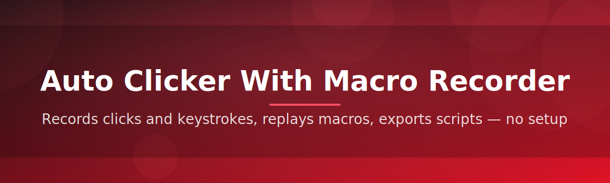
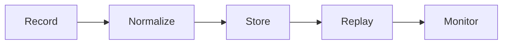

# auto-click-macro-controller 🖱️⚡

  

*Precision clicking and repeatable macros, engineered for people who'd rather automate the tedious parts of a workday than repeat them by hand.*

---

## 🏗️ Overview

**auto-click-macro-controller** is a desktop utility for Windows that combines two disciplines usually shipped as separate tools: a high-precision auto clicker and a full-featured macro recorder. Instead of forcing you to choose between "click fast" and "record actions," it treats both as facets of the same problem — turning a repetitive manual task into a deterministic, replayable sequence. The engine sits close to the OS input layer so clicks and keystrokes land with the same timing character as a human operator, which matters enormously for applications that quietly reject inputs that look too mechanical.

The project exists because most auto-clicker software falls into one of two camps: either it's a single-button novelty with no scheduling logic, or it's an overbuilt automation suite that demands a scripting language before you can double-click anything. This tool aims for the middle ground — a controller that a spreadsheet analyst, a QA tester, a game enthusiast, or an accessibility user can pick up in minutes, while still exposing enough depth (conditional loops, hotkey binding, jitter control) to satisfy power users who want a real macro recorder, not a toy.

Who it's for: anyone whose workflow includes a sequence of clicks or keystrokes that never changes but has to happen dozens or hundreds of times. That includes repetitive data-entry validation, UI regression testing, batch image tagging, or any long-tail clicking task where consistency outperforms manual effort. It is not a replacement for a full RPA platform — it's the tool you reach for when the job is well-defined, local, and doesn't need a server behind it.

  

---

## 🚀 The Feature That Gets People to Star This Repo

Before anything else — the **Adaptive Macro Playback Engine** deserves top billing. Most auto clickers replay a macro at a fixed interval and hope the target application keeps up. This one doesn't hope — it watches. The playback engine monitors cursor position, window focus, and click acknowledgement in real time, then dynamically re-times the next action if the system is lagging. The result is a macro that finishes a 500-step sequence with the same reliability whether your machine is idle or under load. It's the difference between a metronome and a musician who actually listens to the room.

Everything below builds outward from that core.

  

---

## 🎯 What It Actually Does

- **Adaptive timing engine** — recalibrates click intervals on the fly instead of blindly firing at a fixed millisecond rate, so macros stay accurate even when the target app stutters.

- **Full-motion macro recorder** — captures mouse movement paths, click types (left/right/middle), scroll events, and keyboard input as one continuous, editable timeline.

- **Point-and-click sequence builder** — for users who don't want to record anything live, a manual editor lets you place click coordinates and delays directly on a visual canvas.

- **Randomized humanization layer** — optional jitter and micro-delay variance so repeated actions don't look like a perfect, robotic loop.

- **Conditional trigger logic** — start, pause, or stop a macro based on hotkeys, elapsed time, or click-count thresholds, without touching a scripting console.

- **Multi-profile management** — save distinct macro sets per application or task and switch between them instantly from a dropdown, no re-recording required.

- **Global hotkey binding** — assign any key or combo to start/stop/pause, even while the target window doesn't have focus.

- **Lightweight resource footprint** — runs comfortably in the background without competing with whatever application you're actually automating.

> [!TIP]
> Start with a short macro (10–20 steps) to get a feel for timing and jitter settings before building anything long-running. It's much easier to tune a small sequence than to debug a 300-step one.

---

## 🧭 Getting Started

1. Visit the landing page using the download button above or below.

2. Download the latest build — it ships as a single standalone package.

3. Launch the executable directly; there's no separate setup wizard to click through.

4. Record your first macro or configure a simple auto-click interval, then bind a hotkey and go.

> [!NOTE]
> No background services are installed and nothing writes to your Windows startup folder unless you explicitly enable "launch on boot" in Settings.

---

## 💻 System Requirements

| Component | Minimum | Recommended |
|---|---|---|
| OS | Windows 10 (64-bit) | Windows 11 (64-bit) |
| RAM | 2 GB | 4 GB+ |
| Disk space | 50 MB | 100 MB |
| Dependencies | None — standalone executable | None |
| Permissions | Standard user | Standard user (admin only for elevated target apps) |

> [!IMPORTANT]
> If the application you're automating runs elevated (as Administrator), the macro controller must also run elevated — Windows blocks input simulation across privilege boundaries by design.

---

## ⚙️ How It Works

The controller is built around a short, predictable pipeline rather than a black-box engine:

1. **Capture** — raw mouse and keyboard events are intercepted at the input-hook level while recording.

2. **Normalize** — timestamps, coordinates, and event types are cleaned into a portable macro format.

3. **Store** — the sequence is saved as a profile you can rename, duplicate, or export.

4. **Replay** — the adaptive playback engine walks the sequence, re-timing as needed against real-time system feedback.

5. **Monitor** — an internal watchdog checks for stalled windows or missed clicks and halts playback safely rather than spamming a frozen target.

---

## 🧩 Common Pitfalls

<strong>My macro plays back faster than I recorded it — why?</strong>

This usually happens when "Fixed Interval Mode" is enabled instead of "Recorded Timing Mode." Fixed interval ignores your original pauses and uses a flat delay. Switch modes in the playback panel to preserve natural timing.

<strong>The auto clicker stops working inside a specific application.</strong>

Some applications with anti-automation or elevated permission models will silently reject simulated input. Try running the controller with the same privilege level as the target app, and confirm the target window actually has focus before starting playback.

<strong>My global hotkey doesn't trigger the macro.</strong>

Another application may already be bound to that key combination. Open Settings → Hotkeys and reassign to an unused combination — the app will warn you if a conflict is detected.

<strong>Recorded mouse movement looks jumpy on playback.</strong>

This is typically a sampling-rate mismatch on high-refresh-rate displays. Lower the interpolation setting in Recorder Preferences to smooth the captured path.

<strong>The app won't launch after a Windows update.</strong>

Occasionally Windows Defender SmartScreen flags new, less-common executables on first run post-update. Choose "More info → Run anyway" — the binary is unsigned by a major vendor but fully open source and inspectable.

> [!WARNING]
> Always confirm that automating a given task complies with the terms of service of the software you're targeting. This tool is a general-purpose input utility, not a guarantee of compliance for any specific application.

---

## 🎨 Interface, Shortcuts & Personalization

**Themes** — Light, Dark, and a high-contrast "Field" theme for outdoor or low-visibility monitor setups.

**Default keyboard shortcuts:**

| Action | Shortcut |
|---|---|
| Start/Stop macro | `F6` |
| Pause/Resume | `F7` |
| Record new macro | `Ctrl + R` |
| Open profile manager | `Ctrl + P` |
| Quick settings | `Ctrl + ,` |

**Settings worth knowing about:**

> - Click jitter range (0–15px)
> - Playback speed multiplier (0.5x–5x)
> - Auto-save interval for in-progress recordings
> - System tray minimize behavior

---

## 🤝 Contributing & Community

Contributions, issue reports, and feature requests are genuinely welcome — this project grows from real-world automation needs, not a fixed roadmap.

- Open an issue for bugs, with OS version and steps to reproduce.

- Propose features via discussion before submitting large pull requests.

- Keep PRs focused — one capability or fix per pull request makes review faster for everyone.

- Be respectful in code review threads; this is a project built in public, by a community.

---

## 📜 License

Released under the [MIT License](LICENSE), 2026. Use it, fork it, build on it — attribution appreciated but not required beyond the license terms.

---

## ⚖️ Disclaimer

This software is provided "as is," without warranty of any kind. It is a general-purpose input-automation utility intended for legitimate productivity, testing, and accessibility use cases. The maintainers are not responsible for how the tool is used against third-party applications or services, and users are solely responsible for ensuring their usage complies with applicable terms of service and laws.

  

